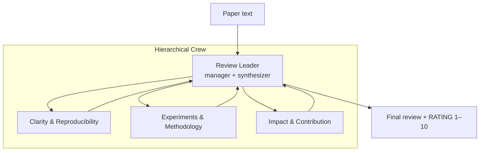

# Multi-Agent Peer Review

Research codebase for evaluating **multi-agent LLM peer review**: a hierarchical CrewAI system with one leader and three specialist reviewers, run over a curated paper dataset with automated metrics for quality, recall, diversity, cost, and alignment with human scores.

The only experimental variable between configurations is **which model is assigned to each role** (leader, clarity, experiments, impact). Prompts, agent topology, and aggregation logic are fixed.

## Architecture



Each role uses its own LLM routed through [OpenRouter](https://openrouter.ai/) (`openrouter/<model>`). The leader delegates to the three experts and synthesizes their feedback into a structured review:

- **Summary**, **Strengths**, **Weaknesses**, **Questions**
- Final line: `RATING: <integer 1–10>`

| Role | Label |
|------|-------|
| `leader` | Review Leader |
| `clarity` | Clarity and Reproducibility Reviewer |
| `experiments` | Experiments and Methodology Reviewer |
| `impact` | Impact and Contribution Reviewer |

## Project layout

```
multi-agent-peer-review/
├── review_agent/          # Multi-agent reviewer (CrewAI)
│   ├── .env.example       # API key template
│   └── src/
│       ├── agents/        # MultiAgentReviewer, prompts
│       └── utils/         # Trace logging, review parsing
├── eval/                  # Experiment orchestration + metrics
│   ├── batches.json       # Run-set definitions (configs × papers)
│   ├── experiments.py     # Batch generation CLI
│   ├── metrics/           # Five evaluation metrics
│   ├── reviews/           # Generated review artifacts (gitignored)
│   └── results/           # Metric outputs (gitignored)
├── dataset/
│   ├── eval_sample_30.json   # 30-paper eval set (tracked)
│   └── sample_eval_set.ipynb # Notebook to regenerate the sample
└── pyproject.toml
```

## Requirements

- Python 3.12 or 3.13
- [Poetry](https://python-poetry.org/)
- An [OpenRouter API key](https://openrouter.ai/keys)

## Setup

```bash
git clone <repo-url>
cd multi-agent-peer-review
poetry install

# Core dependencies only (reviewer + tests)
poetry install --with dev

# Full eval stack (pandas, sentence-transformers, etc.)
poetry install --with dev --with eval

cp review_agent/.env.example review_agent/.env
# Edit review_agent/.env and set OPENROUTER_API_KEY
```

## Quick start

Run a single review on one paper from the eval dataset:

```bash
poetry run python eval/smoke.py
```

This writes artifacts under `eval/outputs/<run_name>/`:

| File | Description |
|------|-------------|
| `final_review.md` | Full markdown review from the leader |
| `review.json` | Parsed sections + rating |
| `trace.jsonl` | Structured event log (delegations, LLM calls, timing) |

You can also call the reviewer directly from Python:

```python
from pathlib import Path
import json
import sys

sys.path.insert(0, "review_agent")
from src.agents.reviewer import MultiAgentReviewer
from src.utils import TraceLogger

paper = json.loads(Path("dataset/eval_sample_30.json").read_text())["papers"][0]
reviewer = MultiAgentReviewer(
    leader_model="qwen/qwen3-32b",
    clarity_model="qwen/qwen3-32b",
    experiments_model="qwen/qwen3-32b",
    impact_model="qwen/qwen3-32b",
)
review = reviewer.review(paper["paper_text"], trace_logger=TraceLogger(), paper_id=paper["id"])
print(review)
```

## Running experiments

Run sets are defined in `eval/batches.json`. Each entry specifies:

- **`pool`** — model aliases (e.g. `"A": "qwen/qwen3-32b"`)
- **`configs`** — role → pool key or raw model slug for each experimental configuration
- **`papers`** — `"all"` or a list of paper IDs from the dataset

The included `pilot` run set has 12 configs (3 homogeneous + 9 heterogeneous) × 5 papers = 60 runs.

```bash
# Preflight: print the run matrix without spending API credits
poetry run python eval/experiments.py --run-set pilot --dry-run

# Generate reviews (skips runs already complete on disk)
poetry run python eval/experiments.py --run-set pilot

# Cap the number of runs (useful for debugging)
poetry run python eval/experiments.py --run-set pilot --limit 2
```

Reviews are written to `eval/reviews/<run-set>/<config>__<paper_id>/`. Each run directory must contain `final_review.md`, `review.json`, and `trace.jsonl` to be considered complete. Re-running is idempotent — completed runs are skipped.

### Adding a run set

Add a new top-level key to `eval/batches.json`:

```json
{
  "my_batch": {
    "pool": { "A": "qwen/qwen3-32b", "B": "mistralai/mistral-small-3.2-24b-instruct" },
    "configs": {
      "All-A": { "leader": "A", "clarity": "A", "experiments": "A", "impact": "A" },
      "het_swap_leader": { "leader": "B", "clarity": "A", "experiments": "A", "impact": "A" }
    },
    "papers": ["8dzKkeWUUb", "FXJm5r17Q7"]
  }
}
```

## Metrics

After generation, compute metrics against a run set. All metric CLIs share `--run-set` and `--dataset` (default: `dataset/eval_sample_30.json`). Results are written to `eval/results/<run-set>/<metric>.json`.

| # | Script | What it measures |
|---|--------|------------------|
| 1 | `eval/metrics/win_rate.py` | LLM-as-judge side-by-side win rate between configs (position-debiased) |
| 2 | `eval/metrics/comment_recall.py` | Recall of human-flagged issues + comment count |
| 3 | `eval/metrics/diversity.py` | Per-role cross-model output diversity (embedding similarity) |
| 4 | `eval/metrics/spearman.py` | Spearman rank correlation of config ratings vs. human mean scores |
| 5 | `eval/metrics/cost.py` | Token usage, USD cost, and wall-clock time per config |

```bash
# Judge-free metrics (no extra LLM calls)
poetry run python eval/metrics/spearman.py --run-set pilot
poetry run python eval/metrics/cost.py --run-set pilot
poetry run python eval/metrics/diversity.py --run-set pilot

# LLM-judge metrics (require OPENROUTER_API_KEY)
poetry run python eval/metrics/win_rate.py --run-set pilot
poetry run python eval/metrics/comment_recall.py --run-set pilot
```

Common flags:

```bash
# Skip artifact validation (e.g. while debugging partial runs)
poetry run python eval/metrics/spearman.py --run-set pilot --no-validate

# Custom judges for win-rate (requires ≥2 out-of-suite models)
poetry run python eval/metrics/win_rate.py --run-set pilot \
  --judge openai/gpt-5-mini --judge deepseek/deepseek-v3.2

# Refresh OpenRouter price table before cost computation
poetry run python eval/metrics/cost.py --run-set pilot --refresh-prices
```

## Dataset

The eval set (`dataset/eval_sample_30.json`) contains 30 papers sampled from DeepReview 2025 test data:

- 10 normal accept, 10 normal reject
- 5 controversial accept, 5 controversial reject (high reviewer disagreement)

Each paper record includes `paper_text`, human `ratings`, `decision`, `stratum`, and `human_reviews`. The full source CSV (`dataset/deepreview_test_2025.csv`, ~129 MB) is gitignored; regenerate the sample with `dataset/sample_eval_set.ipynb` if needed.

Archived reference datasets (PeerRead, DeepReview-13K) live under `archived-datasets/` and are not tracked in git.

## Development

```bash
# Run tests (review_agent + eval unit tests)
poetry run pytest

# Run a specific test module
poetry run pytest eval/tests/test_spec.py -v
```

Optional dependency groups:

| Group | Purpose |
|-------|---------|
| `dev` | pytest, scipy |
| `eval` | pandas, numpy, scipy, sentence-transformers |
| `notebook` | Jupyter, pandas (for dataset sampling) |

## Design notes

- **Fixed prompts** — System prompts are adapted from the MAMORX appendix; task prompts are project-specific. See `review_agent/src/agents/prompts/`.
- **Deterministic generation** — All reviewer LLMs use `temperature=0.0`. Qwen models have thinking mode disabled.
- **Tracing** — CrewAI's built-in tracing is off; this project records its own `trace.jsonl` via `ReviewTraceListener`.
- **Homogeneous vs. heterogeneous configs** — Homogeneous configs (e.g. `All-A`) assign the same model to all four roles. Heterogeneous configs swap one role or rotate models to isolate role-specific effects.
